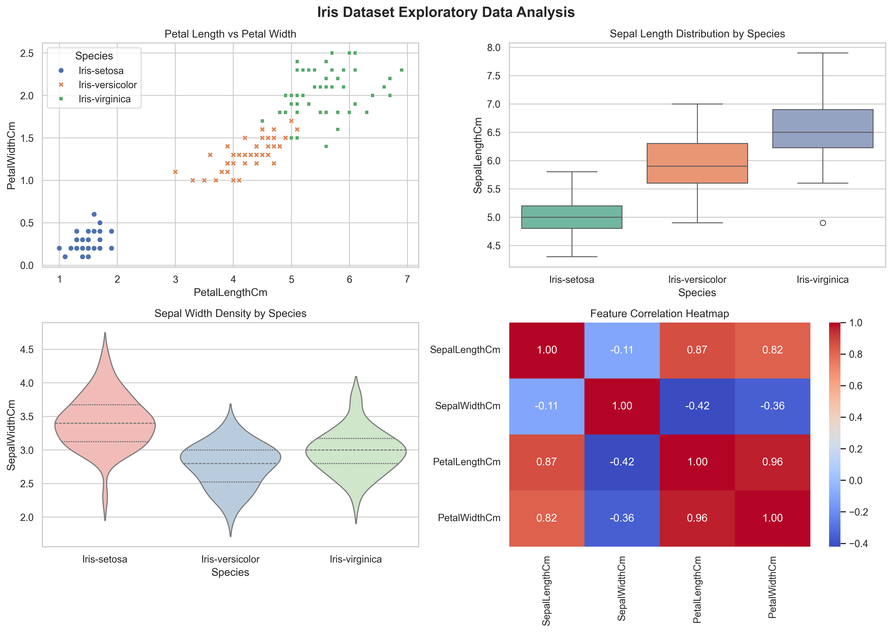

# Iris Flower Classification & EDA

An end-to-end Machine Learning project featuring Exploratory Data Analysis (EDA) and multi-class classification performance evaluation across **K-Nearest Neighbors (kNN)**, **Logistic Regression**, and **Gaussian Naive Bayes** on the Iris dataset.

---

## 📌 Project Overview

The primary objective of this project is to analyze feature distributions and class separability of the Iris dataset before training machine learning models to classify three species of Iris flowers (*Setosa*, *Versicolor*, and *Virginica*). 

To test model generalization with limited training data, all models were trained on a **50% split** (75 samples) and evaluated across the **entire dataset** (150 samples).

---

## 🛠️ Key Data & Preprocessing Steps

1. **Exploratory Data Analysis (EDA):**
   * Plotted a $2 \times 2$ grid subplot combining **Scatterplots**, **Boxplots**, **Violinplots**, and a **Correlation Heatmap** to inspect feature interactions, variance, and multicollinearity.
   * Identified that *Iris-setosa* is linearly separable using `PetalLengthCm` and `PetalWidthCm`.
  
   <p align="center">
  
  </p>
2. **Data Cleaning:**
   * Removed non-predictive primary key column (`Id`).
3. **Data Leakage Prevention:**
   * Used `StandardScaler` inside a `scikit-learn Pipeline` alongside `GridSearchCV` to scale features properly across cross-validation folds without data leakage.

---

## 📊 Model Performance Comparison

| Model | Scaling / Tuning Method | Overall Accuracy | *Setosa* F1-Score | *Versicolor* F1-Score | *Virginica* F1-Score |
| :--- | :--- | :---: | :---: | :---: | :---: |
| **Logistic Regression** | `StandardScaler` | **96.00%** | 1.00 | 0.94 | 0.94 |
| **kNN** | `StandardScaler` + `GridSearchCV` ($k=5$) | **95.33%** | 1.00 | 0.93 | 0.93 |
| **Gaussian Naive Bayes** | Unscaled | **95.33%** | 1.00 | 0.93 | 0.93 |

---

## 💡 Key Findings & Conclusion

* **High Data Efficiency:** Training on 50% of the dataset yielded **95.33%–96.00% accuracy** across all three algorithms on the full dataset.
* **Class Separability:** *Iris-setosa* achieved a **1.00 F1-Score** across all models.
* **Boundary Intersection:** Misclassifications (3–4 instances) occurred exclusively between *Iris-versicolor* and *Iris-virginica* due to natural feature overlap.
* **Final Recommendation:** **Logistic Regression** is recommended for deployment as it achieved the highest accuracy (**96.00%**), alongside low inference latency, a light memory footprint, and direct class probability estimates.

---

## 🛠️ Dependencies & Requirements

To run this project and reproduce the notebook analysis, make sure you have Python 3 installed along with the following libraries:

* **[NumPy](https://numpy.org/)**: Numerical operations and array manipulation.
* **[Pandas](https://pandas.pydata.org/)**: Data loading, tabular manipulation, and exploration.
* **[Matplotlib](https://matplotlib.org/)**: Core data visualization and plotting.
* **[Seaborn](https://seaborn.apache.org/)**: Statistical data visualization.
* **[scikit-learn](https://scikit-learn.org/)**: Machine learning modeling, performance metrics, and evaluation.

### Installation

You can install all required dependencies using `pip`:

```bash
pip install numpy pandas matplotlib seaborn scikit-learn

```

## 📊 Dataset & Credits

* **Dataset Name:** Iris Species Dataset
* **Source:** Originally published by **Ronald A. Fisher** (1936) in *The Annals of Eugenics* ("The use of multiple measurements in taxonomic problems").
* **Provider / Repository:** [UCI Machine Learning Repository](https://archive.ics.uci.edu/ml/datasets/iris) / [Kaggle Iris Dataset](https://www.kaggle.com/datasets/uciml/iris)

### Description
The dataset consists of 150 instances, containing 50 samples from each of three species of Iris flowers (*Iris setosa*, *Iris versicolor*, and *Iris virginica*). Four features are measured from each sample:
1. **Sepal Length** (in cm)
2. **Sepal Width** (in cm)
3. **Petal Length** (in cm)
4. **Petal Width** (in cm)
